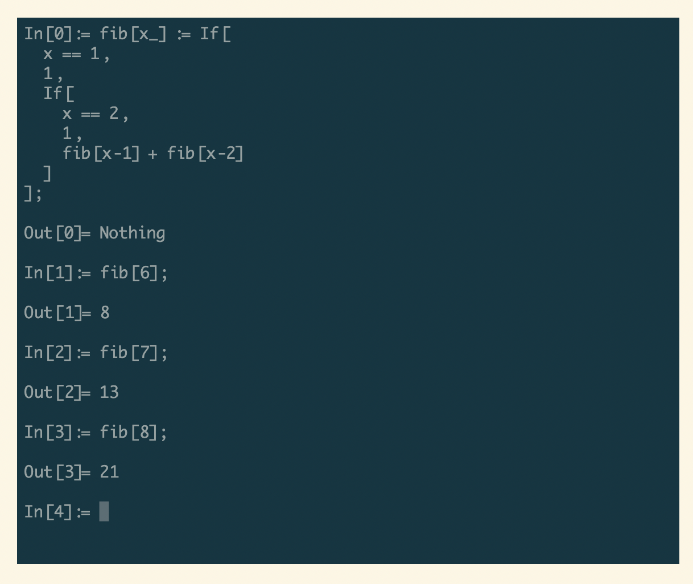
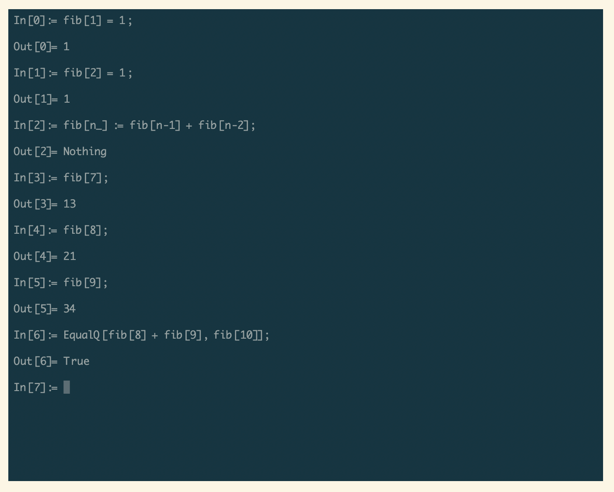
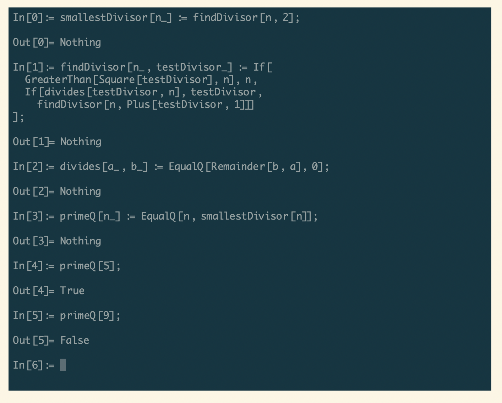
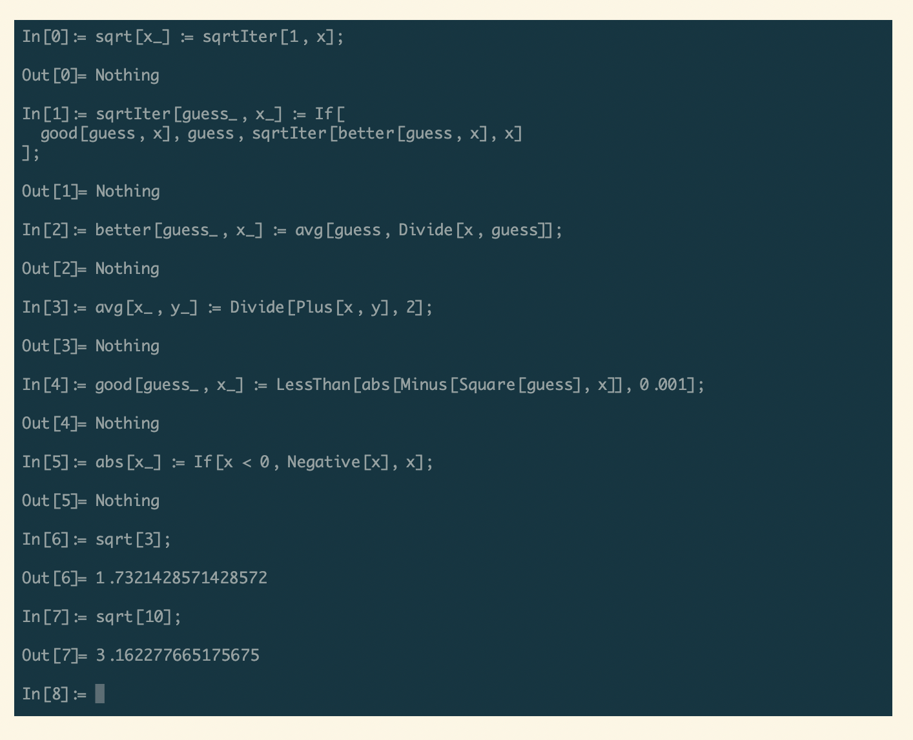

# 表达式求值器 Evaluator

这是一个命令行界面的表达式求值器，能进行一些简单的数学函数运算。支持自定义函数（包括递归函数），支持 If 分支执行。

This is a expression evaluator, it provides commandline interface, it is capable of doing some simple calculations (listed below), as well as of defining custom-defined functions.

这是基于 Nest 框架，以及作者自己写的 Lexer (词法分析器) 和 LL(1) Parser (语法分析器) 来实现的。

This project is based on [Nest.js Framework](https://nestjs.com/), and our own implementation of Lexer, LL(1) Parser, Translator and Evaluator.

## 项目展示

体验地址：https://fe-evaluator.vercel.app/



上图为斐波那契数列求值程序的树型递归写法。



上图为斐波那契数列求值程序的模式匹配写法。



上图为质性判定程序，能够判断一个整数是否是质数。



上图求出给定实数的正的平方根。

## 自部署

1. 测试表明此系统可在 node v16.13.0 LTS 及更高版本上正常运行，确保环境已经安装有合适版本的 node, npm 版本建议为 8.1.0 及以上；

2. `git clone`, 然后进入目录，然后 `npm install`, 成功安装项目所需依赖后，此步骤完成；

3. `npm run start:dev` 或者 `npm run start:inspect` 是启动开发测试环境，后者允许开发者通过 Chrome 或者 VS Code 的 "Attach to Node Process" 功能进行断点调试；`npm run build` 能够生成编译好的 JavaScript 文件（位于 dist 目录下），而后 `npm run start:prod` 可以正式启动系统；

4. 第 3 步完成后，本机的 3000 端口应该处于被某个 node 进程监听的状态，此时我们可以访问[项目的前端地址](https://fe-evaluator.vercel.app/), 并且切换到「本地会话」来使用本地部署的实例，在 Web 页面上的终端虚拟器中，执行 examples 目录下的例程可看到效果。

注：系统默认以生产环境模式启动，要想让系统启动到本地命令行解释器模式，在项目目录下建一个 `.env.development` 文件, 并且在里面加上一行 

```
NODE_ENV=debug
```

即可。

## 致敬 Respects

作者非常喜欢 Wolfram 语言，于是现在是处于上手实现一个简化再简化版本的这么样的一个状态。

I enjoy using Wolfram Language so much, by now I am coding my own very simplified version of it.

以下是我的启发来源：

Here are what I found interesting:

- [Evaluation of Expressions - Wolfram Language & System Documentation Center](https://reference.wolfram.com/language/tutorial/EvaluationOfExpressions.html)（表达式的求值）

- [Everything Is an Expression - Wolfram Language & System Documentation Center](https://reference.wolfram.com/language/tutorial/Expressions.html) (一切皆表达式)

- [Backtracking in Regular Expressions](https://docs.microsoft.com/en-us/dotnet/standard/base-types/backtracking-in-regular-expressions)（讲正则表达式匹配的，关键点就是「回溯」。）

## 已实现函数列表 Currently Supported Functions

```
Plus[x, y]                         # x+y
Minus[x, y]                        # x-y
Times[x, y]                        # x*y
Divide[x, y]                       # x/y
If[x, y, z]                        # 如果 x 为真，返回 y, 否则返回 z
EqualQ[x, y]                       # 若 x 等于 y, 则返回 true, 否则返回 false, 判断方式见源码
Exp[x]                             # 计算 e^{x}
Ln[x]                              # 计算 x 的自然对数
Remainder[x, y]                    # 计算 x 除以 y 得到的余数
Power[x, y]                        # 计算 x^y
Negative[x]                        # 计算 0 - x
Assign[lhs, rhs]                   # 固定赋值，在全局上下文中对 rhs 求值一次，之后如果对 lhs 求值，得到的都是这次 rhs 求值结果
AssignDelayed[lhs, rhs]            # 延迟赋值，在之后对 lhs 求值时，结果为那时在全局上下文中对 rhs 求值的结果
If[cond, trueClause, falseClause]  # 条件求值，先对 cond 求值，若结果不为假，则返回对 trueClause 的求值结果，否则返回对 falseClause 的求值结果
Reduce[lst, function, init]        # 举例：Reduce[{ a, b, c }, f, init] == f[f[f[init, a], b], c]
Seq[n]                             # 返回包含前 n 个正整数升序排列的列表
Seq[n1, n2]                        # 返回以 n1 为首项，1 为公差，n2 为最后一项的等差数列的有限项列表，升序排列
Seq[n1, n2, step]                  # 返回以 n1 为首项，step 为公差，最后一项 M 满足 M < n2 的列表，升序排列
Filter[lst, function]              # 返回一个新的列表，它包含原列表中那些使得 function[ele] 为 True 的 ele, 并且保持原先的顺序
Map[{ e1, e2, ... }, f]            # 对每一项应用 f, 将结果放在一个列表中返回并且列表中的元素保持原先顺序
Let[assignment, expr]              # 在一个局部的临时的作用域中对 expr 求值并返回求值结果
Function[ptn1, ptn2, ..., expr]    # 创建一个匿名函数，最后一项是函数体，函数体前面的都是 pattern, 举例：Function[a_, b_, a+b][1, 2] == 3
```
